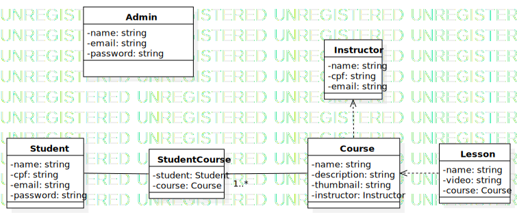

---

## Objetivo

# Hospedar cursos gratuitos profissionalizantes de tecnologia.

## Público-alvo

# Pessoas que se interessem por tecnologia.

## Mercado

# Tecnologia.

## Regra de negócios

### Admin

- CRUD Instrutores;
- CRUD Cursos;
- RUD Alunos;

### Aluno

- Listar cursos;
- Visualizar um curso (Aula);
- Se inscrever em um curso.
- Não poder visualizar um curso em que não esteja inscrito.

# Diagramas

## Classe

