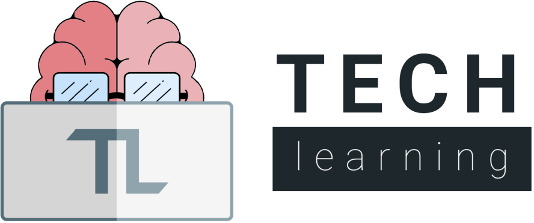
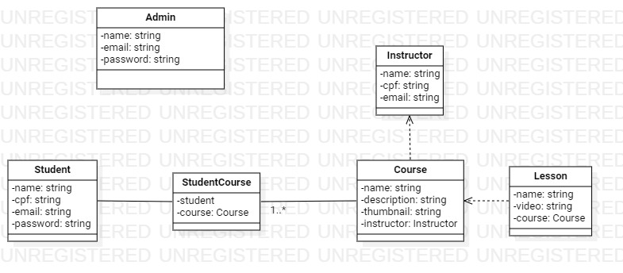
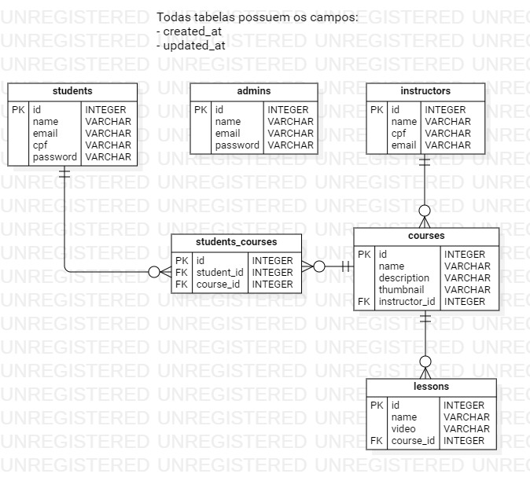

### Membros do grupo: Arthur Freitas, Matheus Manfrin e Paulo Ricardo Faria.

---

 

# Objetivo

## Nosso projeto chamado Tech Learning tem o principal objetivo de oferecer cursos (voltados para a TI) gratuitos para a comunidade. Os cursos são direcionados as pessoas com baixa renda que desejam se profissionalizar na área de TI em geral. Os cursos são feitos e doados por profissionais que se compadecem pela causa da empresa.

 

# Público-alvo

## Pessoas de baixa renda que tem interesse em se profissionalizar na vasta área de TI.

 

# Mercado

## Tecnologia no geral.

 

# Forma de faturamento:

## Através do patrocínio de terceiros e/ou doações.

 

# Regra de negócios / Requisitos funcionais

### Admin

- CRUD Instrutores;
- CRUD Cursos;
- RUD Alunos;

### Aluno

- Listar cursos;
- Visualizar um curso (Aula);
- Se inscrever em um curso.
- Não poder visualizar um curso em que não esteja inscrito.

# Diagramas

## Classe

## Entidade e Relacionamento

